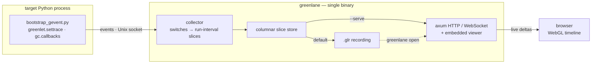
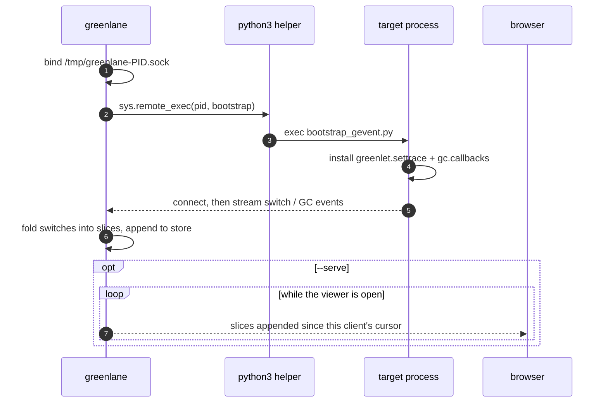

# greenlane


A live timeline profiler for **gevent** applications. greenlane attaches to a
running Python process, traces greenlet switches (and GC pauses), and streams
them to a fast, zoomable web timeline — so you can see _which greenlet ran when_,
what it was doing, and where the hub stalls.

Everything ships as one self-contained binary: a Rust collector and an
HTTP/WebSocket server with the TypeScript/WebGL viewer embedded inside it. There
is nothing to install into the target beyond a small bootstrap that greenlane
injects for you at attach time and removes again when you detach.

## Architecture

greenlane is a pipeline with a deliberately thin, runtime-specific tip and a
generic body. A bootstrap inside the target turns scheduler activity into a
stream of events; everything downstream treats those events as opaque
run-intervals, so the collector, the on-disk format and the viewer never need to
know what produced them.



The bootstrap registers a `greenlet.settrace` hook and a `gc.callbacks` handler,
then writes one tab-delimited line per greenlet switch (and per GC pause) to a
Unix socket. Because that hook runs on the target's hot path inside the
monkey-patched hub, it talks over the raw `_socket` C module rather than the
cooperative socket, so streaming an event can never re-enter the hub and
recurse. The collector folds consecutive switches into per-greenlet
_run-intervals_ — a slice is open from the moment a greenlet is switched in until
the next switch hands control elsewhere — and appends them to a columnar store.
From there a session either streams live to the browser over a WebSocket or is
flattened into a `.glr` file for later; reopening that file rebuilds the exact
same store and serves the exact same viewer, just frozen instead of following
the live edge.

Attaching is a short handshake driven by `sys.remote_exec` (PEP 768), which is
why both the target and the helper interpreter must be CPython 3.14 or newer.



Each viewer holds a cursor — the number of slices it has already received — and
the server hands back the contiguous tail since that cursor on a fixed timer.
That makes streaming lossless: there is no broadcast channel to fall behind on,
no dropped events under load, and therefore no expensive full-snapshot resyncs.
It is also the seam where server-side level-of-detail will eventually live; today
the browser receives raw slices, but the same cursor call can later return
per-pixel aggregates so the wire and the client stay bounded by the screen.

Only the tip of this pipeline is gevent-specific. The collector, the slice
store, the `.glr` format and the viewer all operate on generic run-intervals, so
a second source can feed the same machinery: an asyncio bootstrap built on
`sys.monitoring` (PEP 669) — mapping each task to a lane and the event loop to a
synthetic scheduler lane — is in development against this same wire protocol.

## Build

Requires **Rust** (edition 2024), **bun**, and **CPython 3.14+** on the target.

```sh
make build          # bun build the viewer + cargo build --release
# binary: target/release/greenlane
```

Alongside `build`, the Makefile offers `web` (bundle the viewer on its own),
`run` (debug build and run, passing `ARGS=…`), `linux` (a static musl binary via
`cross`), `deploy` (cross-build then `kubectl cp` into a pod), and `clean`.

## Usage

```sh
# Watch a live timeline in the browser:
greenlane attach <PID> --serve 127.0.0.1:8080
# open http://127.0.0.1:8080

# Or record to a file now, inspect it later:
greenlane attach <PID>                 # writes greenlane-<PID>.glr
greenlane open greenlane-<PID>.glr      # serves it at 127.0.0.1:8080 (static)
```

There is no terminal summary mode: an attach either streams live or records a
capture you reopen later. By default `attach` writes the timeline to
`greenlane-<PID>.glr`; `--serve <addr>` streams the live viewer instead, and
passing both watches live _and_ saves the session on exit (use `--out <path>` to
choose where). The address argument is forgiving — a bare port, a `:port`, or a
full `host:port` all work, with `0.0.0.0:8080` exposing the viewer on the
network. `greenlane open` takes a `.glr` file and the same `--serve` address.

When `sys.remote_exec` is unavailable or blocked, `--no-inject` skips injection
entirely and prints a bootstrap path for you to load into the target yourself
(`exec(open(path).read())`). Point greenlane at a specific helper interpreter
with `--python <bin>` (it must be 3.14+). Both commands accept
`--log-format <text|json>` — `text` is human-readable, `json` emits one
structured object per line — and honor the standard `RUST_LOG` level (default
`info`); all diagnostics go to stderr.

### Attaching — requirements & troubleshooting

To attach, greenlane injects a bootstrap into the target via `sys.remote_exec`
(PEP 768). That needs four things to line up. If `attach` fails, greenlane
classifies the error and prints the fix that applies — the cases below mirror
those messages.

**1. The PID must be a live process.** greenlane checks this up front:

```text
No process with PID <pid> is running.
```

Find the right PID with `pgrep -fl python` or `ps -p <pid>`.

**2. Python 3.14+ on both ends.** `sys.remote_exec` is CPython **3.14+**, and so
is the helper interpreter greenlane shells out to. If you see
`module 'sys' has no attribute 'remote_exec'`, the target or the helper is
older — run the target under 3.14+, or point greenlane at a newer interpreter
with `--python /path/to/python3.14`.

**3. Remote debugging enabled in the target.** It's on by default. It's off if
the target was started with `-X disable_remote_debug`, has
`PYTHON_DISABLE_REMOTE_DEBUG` set in its environment, or was built
`--without-remote-debug`. Clear those and restart the target.

**4. Privileges to access the target.** The OS guards cross-process access:

- **Linux** — needs permission to `ptrace` the target. Easiest is to run as
  root or as the target's owner:

  ```sh
  sudo greenlane attach <PID> ...
  ```

  To skip `sudo` per run, grant the capability to the binary once:

  ```sh
  sudo setcap cap_sys_ptrace+ep $(command -v greenlane)
  ```

  Or relax Yama system-wide (least preferred):
  `sudo sysctl kernel.yama.ptrace_scope=0`. If the target is in a container,
  its process must be visible from greenlane's PID namespace.

- **macOS** — obtaining the target's Mach task port requires elevated rights
  (the failure reads `Cannot get task port for PID … (kern_return_t: 5)`). The
  reliable fix on a stock machine is `sudo`:

  ```sh
  sudo greenlane attach <PID> ...
  ```

  To avoid `sudo`, the greenlane binary needs the **private**
  `com.apple.system-task-ports` entitlement and a matching signature. For local
  development you can self-sign:

  ```sh
  cat > gl.entitlements <<'EOF'
  <?xml version="1.0" encoding="UTF-8"?>
  <!DOCTYPE plist PUBLIC "-//Apple//DTD PLIST 1.0//EN"
    "http://www.apple.com/DTDs/PropertyList-1.0.dtd">
  <plist version="1.0"><dict>
    <key>com.apple.system-task-ports</key><true/>
  </dict></plist>
  EOF
  codesign -s - -f --entitlements gl.entitlements ./target/debug/greenlane
  ```

  Because the entitlement is Apple-private, a self-signed binary may still be
  denied while SIP is on — `sudo` stays the dependable path. Either way the
  target must be owned by the same user as greenlane (or run greenlane as that
  user / root).

On hosts where injection is blocked outright, use `--no-inject` and load the
printed bootstrap into the target yourself.

## The viewer

The timeline gives each greenlet its own lane, drawing one span per
run-interval whose width is the real time that greenlet held the thread. Spans
are rendered with instanced WebGL and frustum culling, so a capture of millions
of them stays fluid as you pan and zoom; the header keeps a running tally of the
session — its live or recording status, the slice count, the mean event rate
over the captured span, and the greenlet and GC counts — and, when you are
viewing a recording, the source `.glr` file name and its size on disk.

Above the lanes, a CPU graph tracks the busy fraction of the single gevent
thread (everything except time spent in the Hub) in step with the spans below,
and vertical markers call out each garbage collection, with the generation,
duration and objects freed available on hover. Runs that stretch into the tens
of milliseconds are tinted to draw the eye — yellow past roughly 20 ms and red
past 50 ms, with the Hub itself never flagged since it is expected to dominate
while the loop is idle — and the same slow spans are gathered into a collapsible
log you can filter by severity, sort by time or duration, and click to jump
straight to the offending span on the timeline.

Selecting a span opens its full call stack as captured at the switch, listed
file by file and line by line; clicking a frame opens that location in your
editor of choice (VS Code, Cursor, Zed or PyCharm). Lanes can be ordered by
greenlet ident or by recent activity over the last second, ten seconds, minute
or the whole capture, and the time axis can read as elapsed time, local
wall-clock or UTC. A live session follows the leading edge as it grows, lets you
drag out a region to zoom into, pan freely, and inspect any single greenlet in
detail — and a detach control stops instrumenting and removes the hook from the
target, leaving the process exactly as greenlane found it.

## Limitations

Because the trace hook runs on the target's hot path, very high switch rates add
real overhead — the full-path call stack is the largest field on each event, and
it is interned client-side to keep the wire and memory in check. Per-span times
are stored as 32-bit milliseconds relative to the start of the trace, which
holds microsecond resolution over a session lasting minutes. There is no
server-side level-of-detail yet, so the browser holds the entire timeline; that
is comfortable for typical sessions but a multi-hour capture would want
viewport-scoped aggregation. Finally, the viewer is served over plain HTTP with
no authentication, so bind it to `127.0.0.1` and reach it through an SSH tunnel
rather than exposing it directly.
