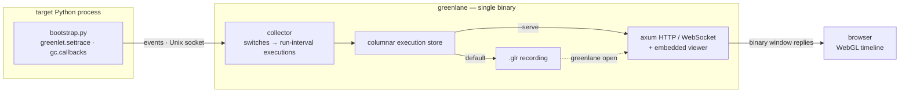
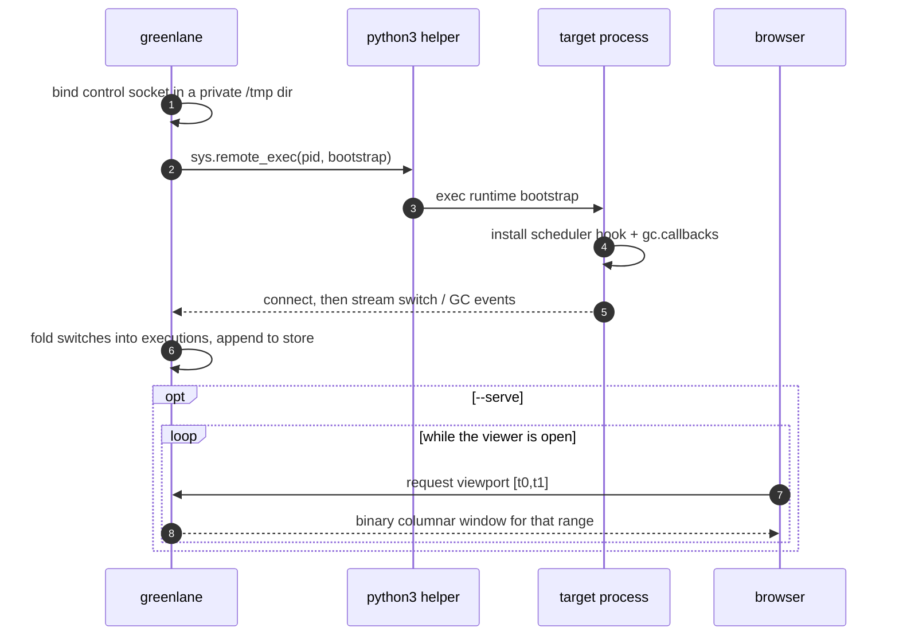

# greenlane — architecture & internals

This document explains how greenlane works end to end: the injection handshake,
the event pipeline, the streaming model, and the viewer. For installation and
day-to-day usage, see the [README](../README.md).

## Overview

greenlane is a pipeline with a deliberately thin, runtime-specific tip and a
generic body. A bootstrap inside the target turns scheduler activity into a
stream of events; everything downstream treats those events as opaque
run-intervals, so the collector, the on-disk format and the viewer never need to
know what produced them.



## The event pipeline

The bootstrap registers gevent's scheduler hook, `greenlet.settrace`, which fires
on every cooperative switch, and also attaches a `gc.callbacks` handler. It then
writes a **binary framed event stream** to a Unix socket: self-describing schema'd
frames, interned string + stack pools so a repeated call stack is sent once, and
delta-encoded timestamps. The encoder is `src/glr.py`; the collector decodes it
with `src/trace_format.rs` (the format's single source of truth). The on-disk
`.glr` is the same format.

Because the hook runs on the
target's hot path, it talks over the raw `_socket` C module rather than
cooperative or event-loop sockets, so streaming an event can never re-enter the
scheduler and recurse.

The collector folds consecutive events into run-interval executions — a execution is open
from the moment a greenlet/task is switched in until the next event hands control
elsewhere — and appends them to a columnar store. From there a session either
streams live to the browser over a WebSocket or is flattened into a `.glr` file
for later; reopening that file rebuilds the exact same store and serves the exact
same viewer, just frozen instead of following the live edge.

Only the tip of this pipeline is gevent-specific. The collector, the execution store,
the `.glr` format and the viewer all operate on generic run-intervals: each
greenlet gets its own timeline row and the Hub is the scheduler greenlet.

## The attach handshake

Attaching is a short handshake driven by `sys.remote_exec` (PEP 768), which is
why both the target and the helper interpreter must be CPython 3.14 or newer.



## Request-driven windows

The viewer is **pull-based**: it requests exactly the viewport it's showing
(`{t0,t1}`) and the server answers from the store with a compact binary columnar
frame for that range — typed-array columns plus a small JSON header, no per-execution
JSON. Each request carries a monotonic id the server echoes, so a reply that
arrives after the view has moved on is dropped. While live, the server also pushes
a tiny `head` (span/total/bytes) on a timer so the viewer follows the edge and the
header stays current; the actual execution data is always pulled, never broadcast, so
there's no channel to fall behind on. This request seam is where server-side
level-of-detail will live: today a window returns raw executions (capped), but the
same call can later return per-pixel aggregates so the wire and client stay
bounded by the screen.

## The viewer

The timeline gives each greenlet its own row, drawing one bar per run-interval
whose width is the real time that greenlet held the hub thread. Spans are rendered with instanced WebGL and frustum
culling, so a capture of millions of them stays fluid as you pan and zoom; the
header keeps a running tally of the session — its live or recording status, the
execution count, the mean event rate over the captured span, the volume of data
processed, and the greenlet and GC counts — and, when you are viewing a recording,
the source `.glr` file name and its size on disk.

Above the greenlets, a CPU graph tracks the busy fraction of the single scheduler
thread in step with the executions below, and vertical markers call out each garbage
collection, with the generation, duration and objects freed available on hover.
Runs that stretch into the tens of milliseconds are tinted to draw the eye —
yellow past the long threshold (≈20 ms) and red past the blocked threshold
(≈50 ms), both configurable with `--long-ms` / `--blocked-ms`, and with the
scheduler greenlet itself never flagged since it is expected to dominate while the
loop is idle.

### Slow log

Those slow executions are also gathered into a collapsible **slow log** docked at the
bottom of the viewer. Unlike the timeline (which only holds the visible
viewport), the slow log is a query run in the database over the **whole** capture,
so it surfaces every execution past the threshold no matter where you're zoomed — its
badge shows the true total count, not a windowed sample. Filter it (all / long /
blocked-tier only), sort by time or duration, and click any row to seek the
timeline straight to that execution. It runs even while collapsed, so the badge stays
live and opening it is instant.

### Call traces (`--include-traces off|slow|all`)

Selecting a execution opens a detail panel with its timing and identity. When a execution
has a captured stack it also shows the **full call stack**, listed file by file
and line by line, each frame clickable to open at that `file:line` in your editor
(VS Code, Cursor, Zed or PyCharm).

Walking the Python stack is the single most expensive thing the hook does on the
target's hot path, so it's **gated by `--include-traces`** and done lazily. The
walk runs at a execution's _close_ — when its duration is known — on the greenlet/task
that just yielded, so the captured stack is the execution's **yield point** (where it
gave up control, often the blocking call). Modes:

- **`slow`** (default): walk only executions at/over the long threshold (`--long-ms`).
  The cost is paid solely for the slow executions you'd investigate, so traces are
  cheap enough to leave on.
- **`all`**: walk every execution (exhaustive; a walk per greenlet switch).
- **`off`**: never walk.

Every execution still carries a cheap leaf-function label (captured at resume) in all
modes. On the wire the binary format interns each distinct stack into a pool and
sends it once, so a repeated chain costs only an id. Use `all`/`slow`
to investigate _where_ time goes; `off` for the lowest-overhead monitoring on very
high-switch-rate apps.

Greenlets can be ordered by identity or by recent activity over the last second, ten
seconds, minute or the whole capture, and the time axis can read as elapsed time,
local wall-clock or UTC. A live session follows the leading edge as it grows,
lets you drag out a region to zoom into, pan freely, and inspect any single greenlet
in detail — and a detach control stops instrumenting and removes the hook from
the target, leaving the process exactly as greenlane found it. The **system**
button (beside help) opens a panel with host, process, interpreter, and live
kernel scheduler-lag details for the target.

## Limitations

Because the trace hook runs on the target's hot path, very high switch rates add
real overhead — most of it the stack walk, which is why `--include-traces`
defaults to `slow` (walk only slow executions) rather than `all`. Stacks are interned
on the wire and again client-side to keep memory in check. Per-execution times cross
the wire as 32-bit milliseconds **relative to the requested window's start** (and
the GPU renders in that window-relative space), so sub-millisecond placement holds
even hours into a capture — an absolute-offset f32 would lose it. There is no
server-side level-of-detail yet, so the browser holds the visible window plus a
margin; that is comfortable for typical sessions but a multi-hour capture would
want viewport-scoped aggregation. Finally, the viewer is served over plain HTTP:
a per-session token (the capability URL greenlane prints) gates `/ws`, `/info`,
and `/detach`, but the traffic isn't encrypted — for a remote host bind to
`127.0.0.1` and reach it through an SSH tunnel rather than exposing it directly.

## Attaching — full requirements & troubleshooting

To attach, greenlane injects a bootstrap into the target via `sys.remote_exec`
(PEP 768). Four things must line up. If `attach` fails, greenlane classifies the
error and prints the fix that applies — the cases below mirror those messages.

**1. The PID must be a live process.** greenlane checks this up front:

```text
No process with PID <pid> is running.
```

Find the right PID with `pgrep -fl python` or `ps -p <pid>`.

**2. Python 3.14+ on both ends.** `sys.remote_exec` is CPython **3.14+**, and so
is the helper interpreter greenlane shells out to. If you see
`module 'sys' has no attribute 'remote_exec'`, the target or the helper is
older — run the target under 3.14+, or point greenlane at a newer interpreter
with `--python /path/to/python3.14`.

**3. Remote debugging enabled in the target.** It's on by default. It's off if
the target was started with `-X disable_remote_debug`, has
`PYTHON_DISABLE_REMOTE_DEBUG` set in its environment, or was built
`--without-remote-debug`. Clear those and restart the target.

**4. Privileges to access the target.** The OS guards cross-process access:

- **Linux** — needs permission to `ptrace` the target. Easiest is to run as
  root or as the target's owner:

  ```sh
  sudo greenlane attach <PID> ...
  ```

  To skip `sudo` per run, grant the capability to the binary once:

  ```sh
  sudo setcap cap_sys_ptrace+ep $(command -v greenlane)
  ```

  Or relax Yama system-wide (least preferred):
  `sudo sysctl kernel.yama.ptrace_scope=0`. If the target is in a container,
  its process must be visible from greenlane's PID namespace.

- **macOS** — obtaining the target's Mach task port requires elevated rights
  (the failure reads `Cannot get task port for PID … (kern_return_t: 5)`). The
  reliable fix on a stock machine is `sudo`:

  ```sh
  sudo greenlane attach <PID> ...
  ```

  To avoid `sudo`, the greenlane binary needs the **private**
  `com.apple.system-task-ports` entitlement and a matching signature. For local
  development you can self-sign:

  ```sh
  cat > gl.entitlements <<'EOF'
  <?xml version="1.0" encoding="UTF-8"?>
  <!DOCTYPE plist PUBLIC "-//Apple//DTD PLIST 1.0//EN"
    "http://www.apple.com/DTDs/PropertyList-1.0.dtd">
  <plist version="1.0"><dict>
    <key>com.apple.system-task-ports</key><true/>
  </dict></plist>
  EOF
  codesign -s - -f --entitlements gl.entitlements ./target/debug/greenlane
  ```

  Because the entitlement is Apple-private, a self-signed binary may still be
  denied while SIP is on — `sudo` stays the dependable path. Either way the
  target must be owned by the same user as greenlane (or run greenlane as that
  user / root).

On hosts where injection is blocked outright, use `--no-inject` and load the
printed bootstrap into the target yourself (`exec(open(path).read())`).
